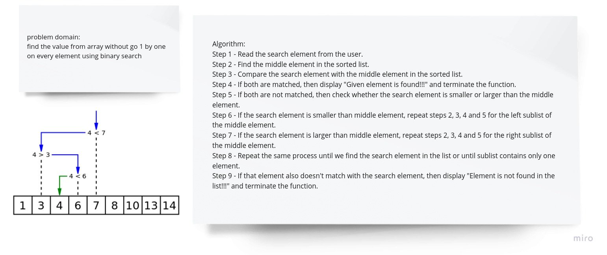

# problem domain:

problem domain:

find the value from array without go 1 by one on every element using binary search

# Algorithm:

Algorithm:

1.  Read the search element from the user.

2.  Find the middle element in the sorted list.

3.  Compare the search element with the middle element in the sorted list.

4.  If both are matched, then display "Given element is found!!!" and terminate the function.

5.  If both are not matched, then check whether the search element is smaller or larger than the middle element.

6.  If the search element is smaller than middle element, repeat steps 2, 3, 4 and 5 for the left sublist of the middle element.

7.  If the search element is larger than middle element, repeat steps 2, 3, 4 and 5 for the right sublist of the middle element.

8.  Repeat the same process until we find the search element in the list or until sublist contains only one element.

9.  If that element also doesn't match with the search element, then display "Element is not found in the list!!!" and terminate the function.

# solution

