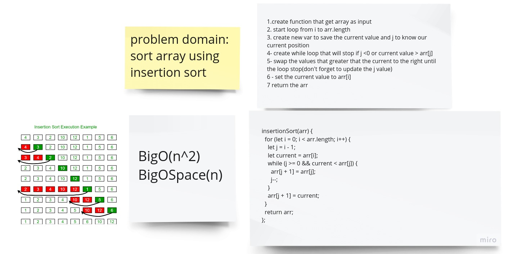

## Pseudocode

```
InsertionSort(int[] arr)

    FOR i = 1 to arr.length

      int j <-- i - 1
      int temp <-- arr[i]

      WHILE j >= 0 AND temp < arr[j]
        arr[j + 1] <-- arr[j]
        j <-- j - 1

      arr[j + 1] <-- temp

```

# Example and tracing

- step 1

  [8,4,23,42,16,15]
  new arr = [8]

- step 2

temp = 4

4 > 8 false => [4,8]

- step 3

23 > 8 true => [4,8,23]

- step 4

42 > 23 true => [4,8,23,42]

- step 5

16 < 42,23 true => [4,8,16,23,42]

- step 6

15 < 16,42,23 true => [4,8,15,16,23,42]


