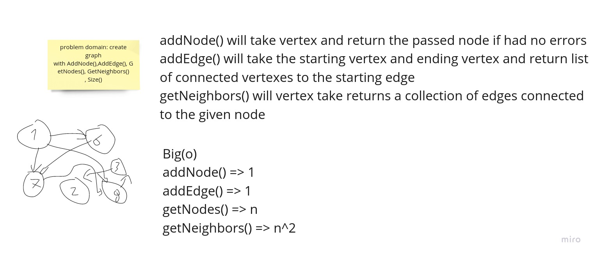

## problem domain:

create graph with AddNode(),AddEdge(), GetNodes(), GetNeighbors() , Size()

## api

addNode() will take vertex and return the passed node if had no errors

addEdge() will take the starting vertex and ending vertex and return list of connected vertexes to the starting edge

getNeighbors() will vertex take returns a collection of edges connected to the given node

GetNodes() will return all the nodes

Size() will return the number of the nodes

## Big(o)

- addNode() => 1

- addEdge() => 1

- getNodes() => n

- getNeighbors() => n^2

