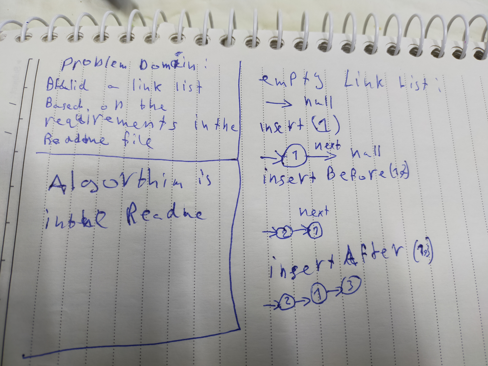

# Singly Linked List

A linked list is a linear data structure, in which the elements are not stored at contiguous memory locations. The elements in a linked list are linked using pointers

## Challenge

to implement the linked list

day 1 :

- insert():insert node to the end of the list
- includes(): check ifthe given value is found
- toString(): log the linked list as 1->2->3->null

-day 2 :

- insertBefore(value, newVal): which add a new node with the given newValue immediately before the first value node
- insertAfter(value, newVal): which add a new node with the given newValue immediately after the first value node
- insertAtStart(value): which adds a new node with the given value to the start of the list

## Approach & Efficiency & ## API

<!-- What approach did you take? Why? What is the Big O space/time for this approach? -->
<!-- Description of each method publicly available to your Linked List -->

- insert(): if it is empty then head => node else keep search until find next = null then add the new node to it (big O => 1)
- includes(): check if the given value is found, trace over the list and if found it then return true else false (big O is n)
- toString(): trace over all the nodes and add then into an array then use join method to join them (big O is n)
- insertBefore(value, newVal): first call includes() to make sure the value is valid this save the next node in a temp variable to note lose the reference to - it and finally append the new node into the prev node and append the temp val into the new node next (big O is n)
- insertAfter(value, newVal): first call includes() to make sure the value is valid this save the prev node in a temp variable to note lose the reference to it and finally append the new node into the prev node and append the temp val into the new node next (big O is n)
- insertAtStart(value): create new node and and let next of the new node = of old head and assign the head to the new node (big = 1)

