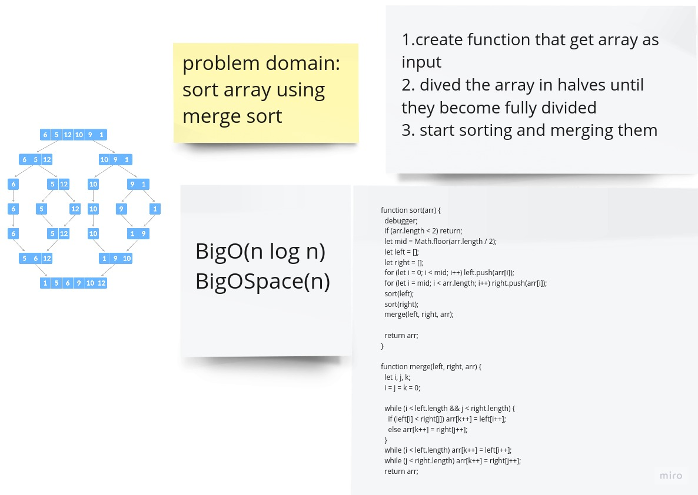

- consider arr = [8, 4, 23, 42, 16, 15]

keep divideing it

[8, 4, 23,] [42, 16, 15]

[8][4, 23] [42][16, 15]

[4][23] , [16][15]

merge and sort them [4,23] , [15,16]

[8],[4,23] | [42],[15,16]

merge and sort them [4,8,23]

merge and sort them [15,16,42]
[4,8,23] | [15,16,42]

merge and sort them [4,8,15,16,23,42]

return [4,8,15,16,23,42]

