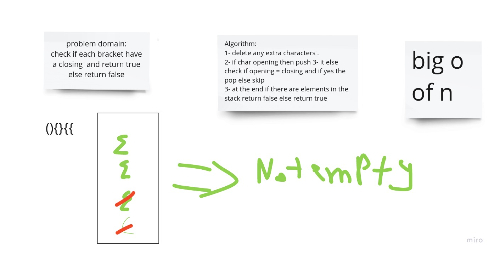

# Stacks and Queues

Stack is a container of objects that are inserted and removed according to the last-in first-out (LIFO) principle.

Queue is a container of objects (a linear collection) that are inserted and removed according to the first-in first-out (FIFO) principle.

## Challenge

problem domain:

check if each bracket have a closing and return true else return false

## Approach & Efficiency & api

### isOpening

check if it is or not opening brackt
(big o 1)

### closing(str)

return opening form closing
(big o 1)

### isBracket()

return true if bracket
(big o 1)

### validate

return true if balanced flase if nor

