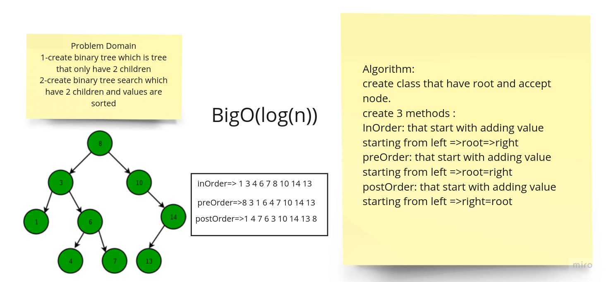
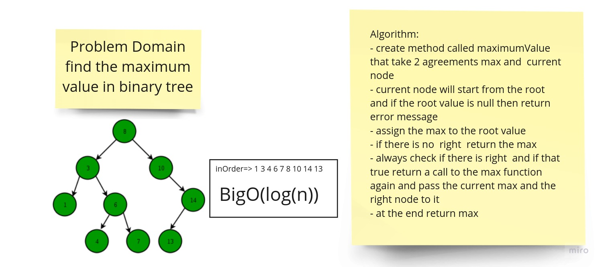

# Tree

1-create binary tree which is tree that only have 2 children

2-create binary tree search which have 2 children and values are sorted

## Challenge

- Define a method for each of the depth first traversals called preOrder, inOrder, and postOrder which returns an array of the values, ordered appropriately.

- Create a BinarySearchTree class
- - Define a method named add that accepts a value, and adds a new node with that value in the correct location in the binary search tree.
- - Define a method named contains that accepts a value, and returns a boolean indicating whether or not the value is in the tree at least once.

## Approach & Efficiency & api

### add(value)

insert new node into the tree but in sorted way (log n)

### inOrder()

return array represent the tree based on left > root > right (log n)

### preOrder()

return array represent the tree based on root > left > right (log n)

### postOrder()

return array represent the tree based on left > right > root (log n)

### postOrder()

return array represent the tree based on left > right > root (log n)

### max

- create method called maximumValue that take 2 agreements max and current node

- current node will start from the root and if the root value is null then return error message

- assign the max to the root value

- if there is no right return the max

- always check if there is right and if that true return a call to the max function again and pass the current max and the right node to it

- at the end return max

