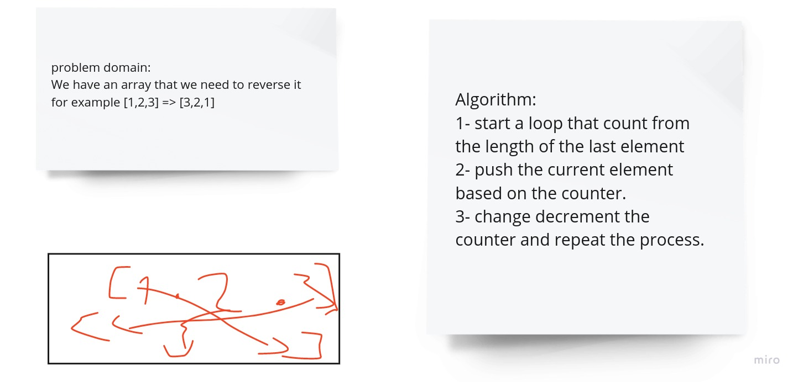

# problem domain:

We have an array that we need to reverse it for example [1,2,3] => [3,2,1]

# Algorithm:

1. start a loop that count from the length of the last element

2. push the current element based on the counter.

3. change decrement the counter and repeat the process.

**_ the solution in array-reverse.test.js_**

# solution

