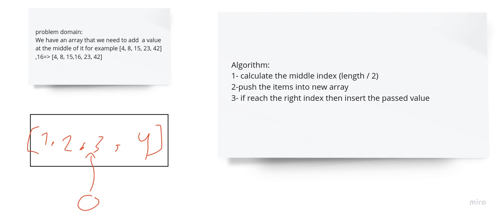

# problem domain:

problem domain:

We have an array that we need to add a value at the middle of it for example [4, 8, 15, 23, 42] ,16=> [4, 8, 15,16, 23, 42]

# Algorithm:

Algorithm:

1.  calculate the middle index (length / 2)

2.  push the items into new array

3.  if reach the right index then insert the passed value

**_ the solution in array-reverse.test.js_**

# solution

